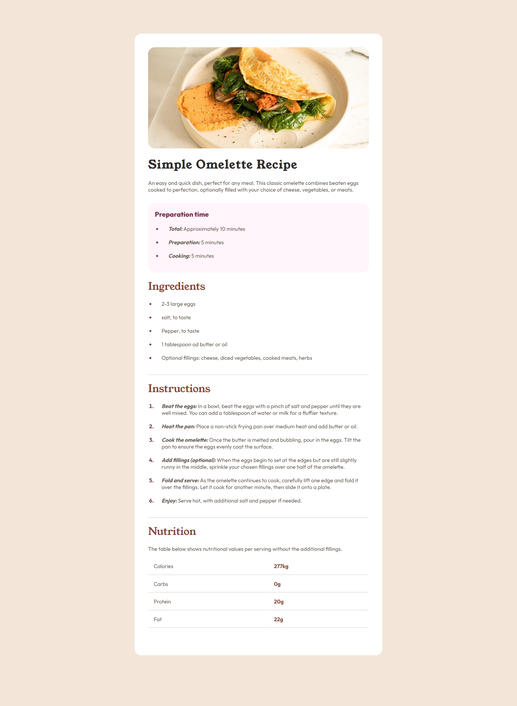

# Frontend Mentor - Solução para o desafio Pagina de receita

Esta é a solução para o [desafio pagina de receita no Frontend Mentor](https://www.frontendmentor.io/challenges/recipe-page-KiTsR8QQKm). Os desafios do Frontend Mentor ajudam você a aprimorar suas habilidades de codificação, construindo projetos realistas.

## Visão Geral 

## Links 

## Meu processo

- Link solução: [Recipe Page Solution](https://www.frontendmentor.io/solutions/soluo-recipe-page-mS1hcSqaFF)
- Link Site: [Confira o site ao vivo](https://alinerhanny.github.io/recipe-page/)

### Construido com:
- HTML5
- CSS
- flexbox
